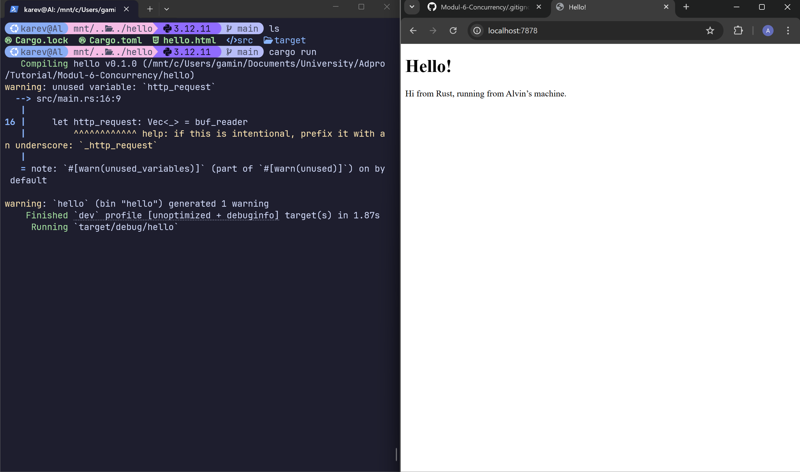
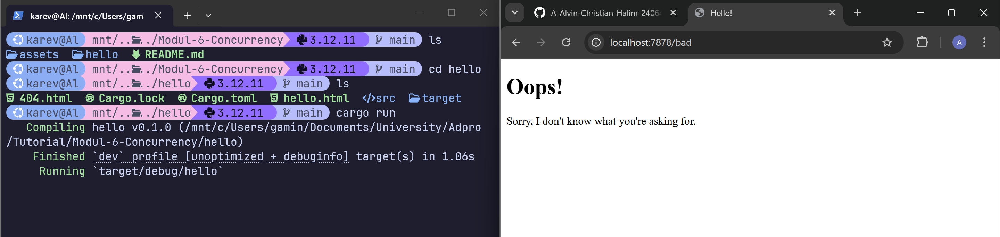

# Modul-6-Concurrency

## Commit 1 Reflaction Notes

Berikut adalah kode untuk commit 1

```rs
use std::{
    io::{BufReader, prelude::*},
    net::{TcpListener, TcpStream},
};
fn main() {
    let listener = TcpListener::bind("127.0.0.1:7878").unwrap();
    for stream in listener.incoming() {
        let stream = stream.unwrap();
        handle_connection(stream);
    }
}
fn handle_connection(mut stream: TcpStream) {
    let buf_reader = BufReader::new(&mut stream);
    let http_request: Vec<_> = buf_reader
        .lines()
        .map(|result| result.unwrap())
        .take_while(|line| !line.is_empty())
        .collect();
    println!("Request: {:#?}", http_request);
}

```

Kode tersebut merupakan implementasi http server pada bahasa rust. Pada fungsi main, kita membuat sebuah tcp listener pada localhost port 7878. Ketika listener menerima sebuah koneksi, stream data yang diterima akan diproses menggunakan fungsi `handle_connection`

Fungsi `handle_connection` menerima parameter `stream` bertipe `TcpStream` dan bersifat mutable (ada keyword `mut`). Kemudian kode menggunakan `BufReader` untuk menyediakan buffering pada operasi I/O. Stream dipinjam secara mutable (`&mut stream`), bukan dipindahkan ownership-nya, sehingga masih bisa digunakan di konteks lain jika diperlukan. Selanjutnya, `buf_reader.lines()` mengubah stream menjadi iterator per baris, di mana setiap hasil bertipe `Result<String, Error>`, lalu diekstrak menggunakan unwrap(). Dengan .take_while(|line| !line.is_empty()), fungsi mengambil bagian header HTTP hingga menemukan baris kosong (penanda akhir header). Hasilnya kemudian dikumpulkan menjadi Vec<String> menggunakan .collect(). Terakhir, isi request dicetak ke console.

Ketika menjalankan kode tersebut dan mengunjungi browser saya pada `http://127.0.0.1:7878`, saya mendapatkan output berikut

```
cargo run
    Finished `dev` profile [unoptimized + debuginfo] target(s) in 0.30s
     Running `target/debug/hello`
Request: [
    "GET / HTTP/1.1",
    "Host: 127.0.0.1:7878",
    "Connection: keep-alive",
    "sec-ch-ua: \"Google Chrome\";v=\"147\", \"Not.A/Brand\";v=\"8\", \"Chromium\";v=\"147\"",
    "sec-ch-ua-mobile: ?0",
    "sec-ch-ua-platform: \"Windows\"",
    "Upgrade-Insecure-Requests: 1",
    "User-Agent: Mozilla/5.0 (Windows NT 10.0; Win64; x64) AppleWebKit/537.36 (KHTML, like Gecko) Chrome/147.0.0.0 Safari/537.36",
    "Accept: text/html,application/xhtml+xml,application/xml;q=0.9,image/avif,image/webp,image/apng,*/*;q=0.8,application/signed-exchange;v=b3;q=0.7",
    "Sec-Fetch-Site: none",
    "Sec-Fetch-Mode: navigate",
    "Sec-Fetch-User: ?1",
    "Sec-Fetch-Dest: document",
    "Accept-Encoding: gzip, deflate, br, zstd",
    "Accept-Language: en-ID,en;q=0.9,id-ID;q=0.8,id;q=0.7,en-GB;q=0.6,en-US;q=0.5",
    "Cookie: csrftoken=ZaHe8DVijfzEnMQ6EKl56L96lx0TVjor",
]
```

Output tersebut adalah http request yang diterima oleh server kita. Baris pertama, `"GET / HTTP/1.1"`, adalah request line yang berisi metode GET, path yang diminta yaitu `/` (root), serta versi protokol HTTP/1.1. Baris-baris berikutnya adalah header yang memberikan informasi tambahan tentang request. Misalnya, `"Host: 127.0.0.1:7878"` menunjukkan alamat tujuan, `"Connection: keep-alive"` menandakan koneksi tetap dibuka setelah response, dan `"User-Agent: Mozilla/5.0 ..."` mengidentifikasi browser serta sistem operasi yang digunakan. Header seperti `"Accept"` dan `"Accept-Encoding"` menjelaskan jenis konten dan kompresi yang didukung oleh client, sedangkan `"Accept-Language"` menunjukkan preferensi bahasa pengguna. Header `"sec-ch-ua"` dan `"Sec-Fetch-*"` memberikan konteks tambahan tentang perangkat, platform, dan cara request dilakukan. Terakhir, "Cookie: csrftoken=..." berisi data cookie yang biasanya digunakan untuk session atau keamanan.

## Commit 2 reflection notes



```rs
use std::{
    fs,
    io::{BufReader, prelude::*},
    net::{TcpListener, TcpStream},
};
fn main() {
    let listener = TcpListener::bind("127.0.0.1:7878").unwrap();
    for stream in listener.incoming() {
        let stream = stream.unwrap();
        handle_connection(stream);
    }
}

fn handle_connection(mut stream: TcpStream) {
    let buf_reader = BufReader::new(&mut stream);

    let http_request: Vec<_> = buf_reader
        .lines()
        .map(|result| result.unwrap())
        .take_while(|line| !line.is_empty())
        .collect();
    let status_line = "HTTP/1.1 200 OK";
    let contents = fs::read_to_string("hello.html").unwrap();
    let length = contents.len();
    let response = format!("{status_line}\r\nContent-Length: {length}\r\n\r\n{contents}");
    stream.write_all(response.as_bytes()).unwrap();
}
```

Pada commit kali ini kita memodifikasi fungsi `handle_connection` agar dapat menunjukkan sebuah html. Modifikasi dimulai dengan mendefinisikan status line http response sebagai `"HTTP/1.1 200 OK"`. Setelah itu fungsi membaca isi file `hello.html` menggunakan `fs::read_to_string` lalu menyimpannya pada variabel `contents`. Setelah itu variabel `length` digunakan untuk menyimpan panjang dari content. Terakhir variable `response` menyimpan http response yang telah dibuat menggunakan data `status_line`, `length`, dan `contents`. Kemudian terakhir response tersebut dikirim balik lewat stream TCP dengan fungsi `write_all`

Dalam format HTTP response yang dibuat, `status_line` adalah baris pertama yang berisi versi HTTP, kode status, dan pesan status untuk memberi tahu client apakah request berhasil atau tidak. `length` merupakan nilai dari header Content-Length yang menunjukkan ukuran body response dalam satuan byte, sehingga client mengetahui kapan data selesai diterima. Sementara itu, `contents` adalah isi utama response (body) yang dikirim ke client, dalam kasus ini adalah HTML namun bisa juga JSON atau teks biasa.

## Commit 3 reflection notes


Pada commit ini kita membuat perubahan pada fungsi `handle_connection` agar bisa membedakan antara request yang valid dan tidak valid

```rs
fn handle_connection(mut stream: TcpStream) {
    let buf_reader = BufReader::new(&stream);
    let request_line = buf_reader.lines().next().unwrap().unwrap();

    if request_line == "GET / HTTP/1.1" {
        let status_line = "HTTP/1.1 200 OK";
        let contents = fs::read_to_string("hello.html").unwrap();
        let length = contents.len();

        let response = format!(
            "{status_line}\r\nContent-Length: {length}\r\n\r\n{contents}"
        );

        stream.write_all(response.as_bytes()).unwrap();
    } else {
        let status_line = "HTTP/1.1 404 NOT FOUND";
        let contents = fs::read_to_string("404.html").unwrap();
        let length = contents.len();

        let response = format!(
            "{status_line}\r\nContent-Length: {length}\r\n\r\n{contents}"
        );
        stream.write_all(response.as_bytes()).unwrap();
    }
}
```
Jika kita melihat balik pada contoh request di commit 1, kita dapat melihat bahwa baris pertama dari request tersebut adalah `GET / HTTP/1.1`. Baris ini menunjukkan bahwa kita membuat GET request pada endpoint `/`. Maka apabila kita membuat GET request pada endpoint, contohnya `/bad`, maka baris pertama akan bernilai `GET /bad HTTP/1.1`. If statement yang kita tambahkan mengecek apabila baris kita membuat GET request pada endpoint `/`. Jika iya, maka kita akan menunjukkan `hello.html`. Tapi jika kita membuat request ke endpoint lain, akan menunjukkan `404.html` dengan status line `404 NOT FOUND`

Jika kita perhatikan pada block if-else, terdapat code duplication, persisnya

```rs
        let length = contents.len();

        let response = format!(
            "{status_line}\r\nContent-Length: {length}\r\n\r\n{contents}"
        );
        stream.write_all(response.as_bytes()).unwrap();
```

Agar mengurangi code duplication, kita bisa melakukan refactoring menjadi kode berikut
```rs
// --snip--

fn handle_connection(mut stream: TcpStream) {
    // --snip--

    let (status_line, filename) = if request_line == "GET / HTTP/1.1" {
        ("HTTP/1.1 200 OK", "hello.html")
    } else {
        ("HTTP/1.1 404 NOT FOUND", "404.html")
    };

    let contents = fs::read_to_string(filename).unwrap();
    let length = contents.len();

    let response =
        format!("{status_line}\r\nContent-Length: {length}\r\n\r\n{contents}");

    stream.write_all(response.as_bytes()).unwrap();
}
```

Pada refactoring ini kita membuat if-else block tersebut me-return sebuah nilai tuple `(status_line, filename)`. Setelah itu kita menggunakan destructuring untuk assign 2 nilai tersebut ke variable `status_line` dan `filename`. Dengan begitu, kita bisa menggunakan value tersebut pada response constructing kita sehingga kita ada code duplication untuk membuat response. 

